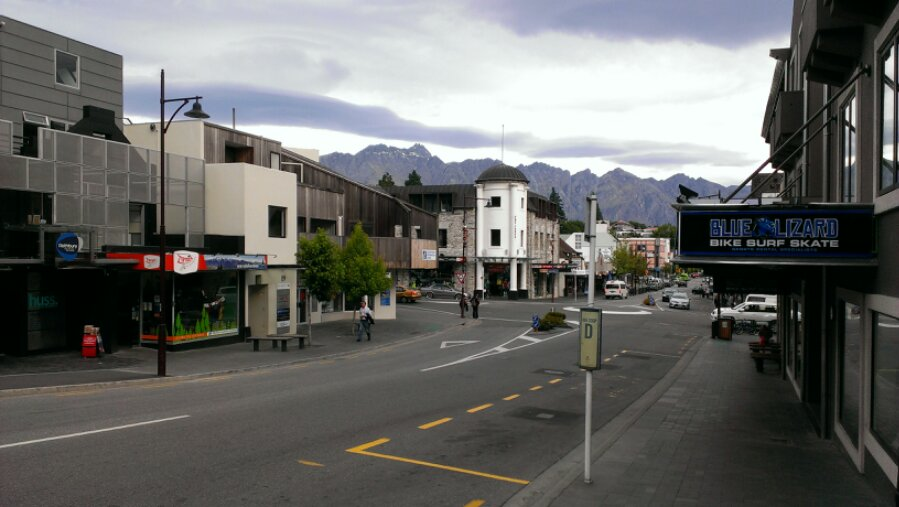
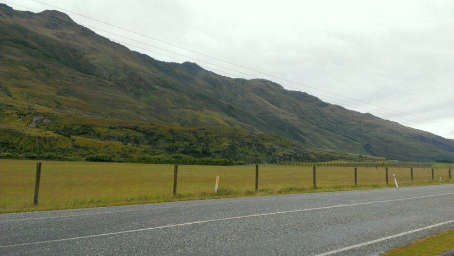
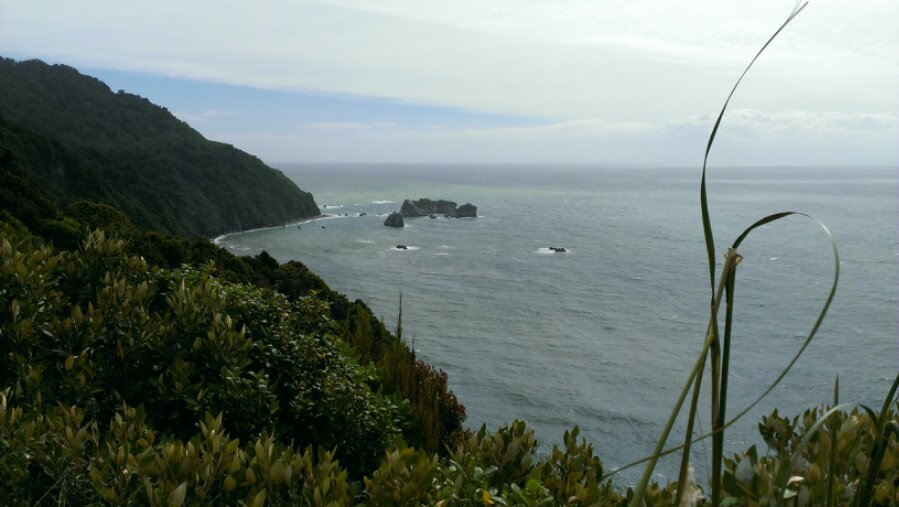

Today we drove to the westcost. Renting a car was not possibile because all cars were already booked.

In fact the coach we finally took stopped half way because bad weather broke the highway 6. We had 
luck and after waiting several hours it continued and we’re now finaly at “Fox Glacier”. Tomorrow 
we habs a guided tour hike through the ice…

Queenstown

Stopover

Tasman Sea
