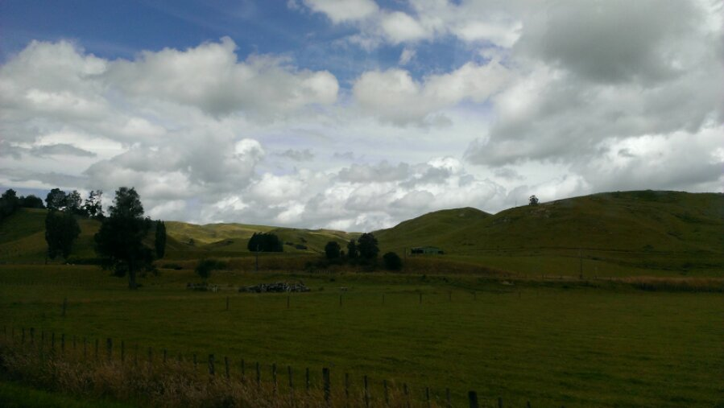
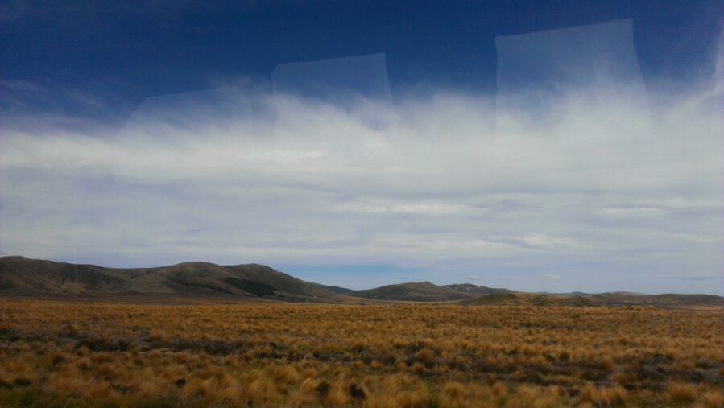
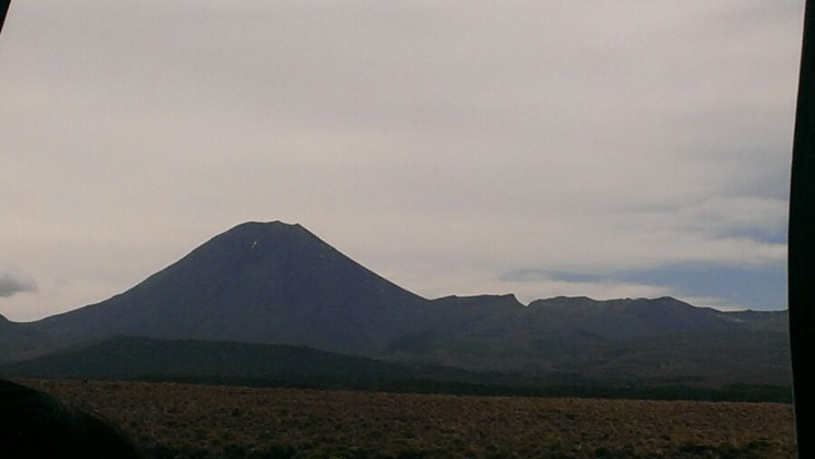

Today we took the bus from Wellington to Taupo. So we passed green 
sheep lawn valee “Hobbingen” over vulcano desert landscapes to “Mordor”. 
And all of this in about 6 hours, quit amazing! Today we visited and 
swam in hot springs. The day after tomorrow we’ll do our final vulcano 
hike, the “Tongorio northern circuit”. Hopefully the weather is fine, 
forecast looks bad… Cya soon!

