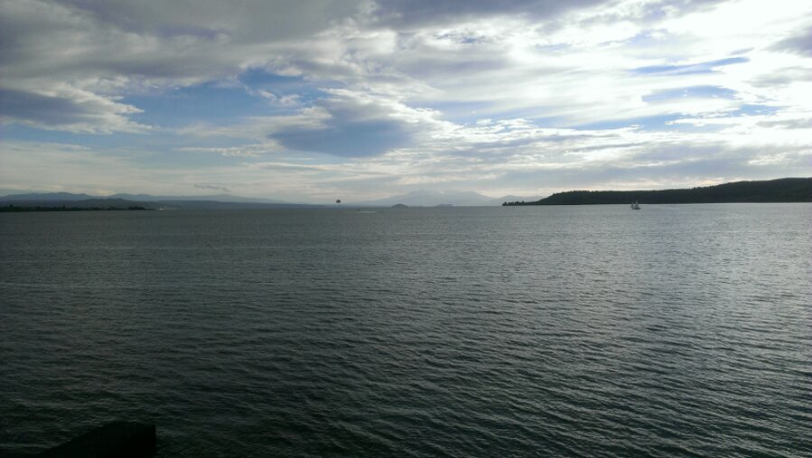
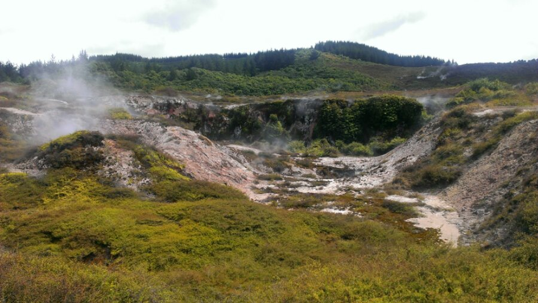
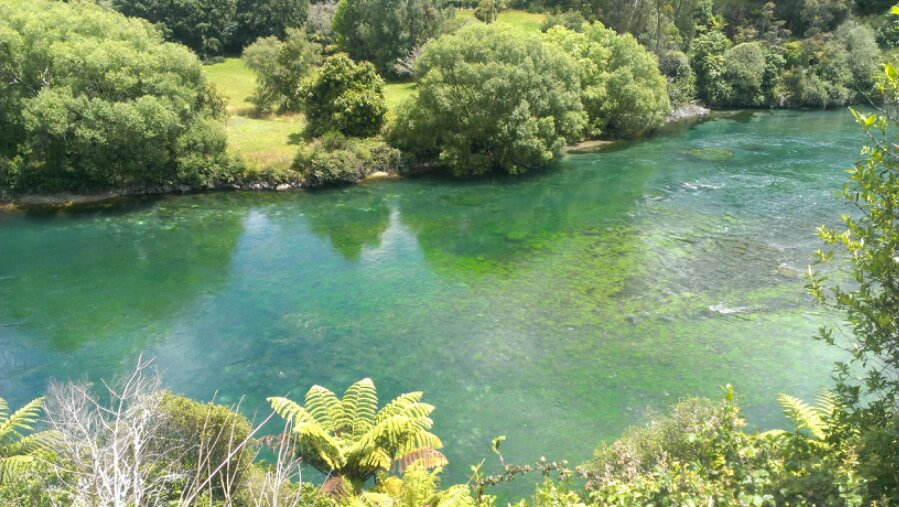
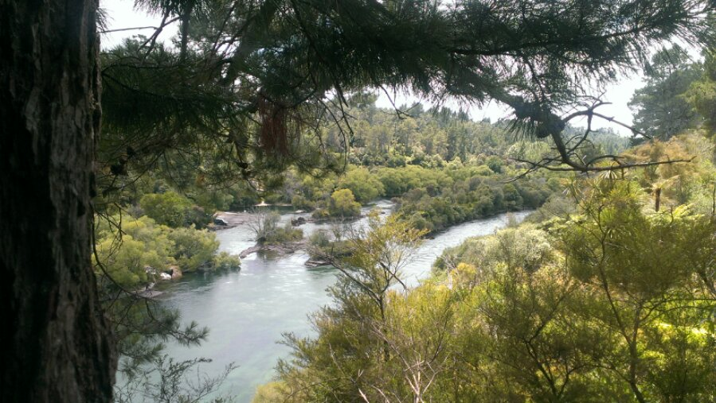

Just a small sidetrip today. Taupo is where we actually stay another night. 
The hot springs at “Crators of the Moon” and “Hooka Falls & River” are just 
within a one hour walking distance, so we checked ‘em out today. Tomorrow 4 
days hardcore hiking at “Mordor” will follow, so far, till later…

